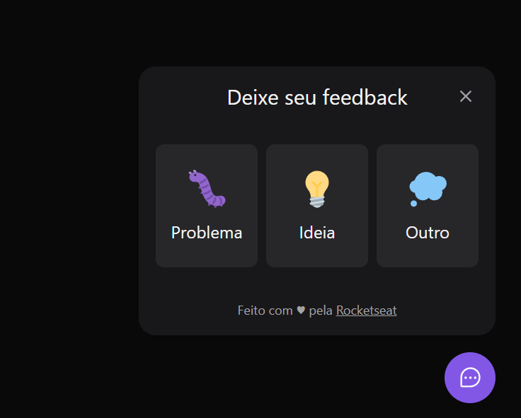

<p align="center">
  <a href="" rel="noopener">
 </a>
</p>
<h3 align="center">Feedback Widget</h3>

<div align="center">

<a src="https://www.rocketseat.com.br/">

</a>

<a src="https://feedback-widget-coral.vercel.app/">

</a>

<a src="LICENSE.md">

</a>

</div>

---

<p align="center"> A Feedback component to facilitate user communication with the <br/>website developer or owner
    <br> 
</p>

## 📝 Table of Contents

- [Setting up a local environment](#getting_started)
- [Usage](#usage)
- [Technology Stack](#tech_stack)
- [Contributing](../CONTRIBUTING.md)
- [Authors](#authors)
- [Acknowledgments](#acknowledgments)

## 🏁 Getting Started <a name = "getting_started"></a>

These instructions will get you a copy of the project up and running on your local machine for development and testing purposes.

### Prerequisites

What things you need to install the software and how to install them.

- [x] NodeJS

  1. Go to the website [NodeJS](https://nodejs.org/en/).
  2. Choose LTS option to Download.
  3. Install in your computer.

- [x] Download the project

```bash
  # Clone the repository
  $ git clone https://github.com/eliveutonsouza/feedback-widget.git

  # Enter directory
  $ cd feedback-widget
```

### Installing

How to install all project dependencies.

##### 💻 Versão Web

```bash
  # Install server project dependencies and run the application
  # (Inside the project folder)
  $ cd server
  $ npm install
  $ npm run dev
  $ cd ..

  # Install dependencies from the web folder and run the application
  $ cd web
  $ npm install
  $ npm run dev
```

##### 📲 Versão Mobile

```bash
  # Instalar dependências do projeto server e executar a aplicação
  # (Dentro da pasta do projeto)
  $ cd server
  $ npm install
  $ npm run dev
  $ cd ..

  # Instalar depências da pasta mobile e executar a aplicação
  $ cd mobile
  $ expo install
  $ expo run dev
```

## ⛏️ Built With <a name = "tech_stack"></a>

- [ReactJS](https://reactjs.org)
- [NodeJS](https://nodejs.org/en/)
- [ReactNative](https://reactnative.dev/)
- [Prisma](https://www.prisma.io/)
- [Tailwind](https://tailwindcss.com/)
- [Jest](https://jestjs.io/pt-BR/)

## ✍️ Authors <a name = "authors"></a>

This project is under license from MIT. For more details, see the [LICENSE](LICENSE.md) file.

Made with 💜 by <a href="https://github.com/{{YOUR_GITHUB_USERNAME}}" target="_blank">Eliveuton Souza</a>

&#xa0;

<a href="#top">🆙 Back to top</a>
